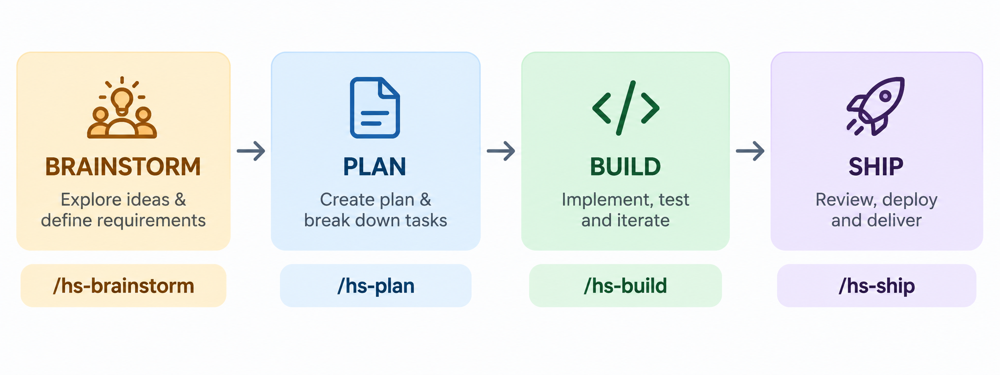

# Harness Skills

It provides 9 reusable skills, 5 specialist
subagents, and 4 hooks, installable into 6 agent runtimes: Claude
Code, Cursor, OpenAI Codex CLI, GitHub Copilot, Kiro, and Google Antigravity.
No runtime gets a slash-command layer - every runtime invokes a skill by
matching the task to its description, the same way Claude Code does
natively. Read `CONCEPTS.md` first to understand the underlying model.



## Install

Install directly from GitHub - no manual clone required.

```powershell
# Windows - installs Claude Code by default
irm https://raw.githubusercontent.com/Unibean9/harness-skills/main/install.ps1 | iex
```

```bash
# macOS/Linux - installs Claude Code by default
curl -fsSL https://raw.githubusercontent.com/Unibean9/harness-skills/main/install.sh | bash
```

To install a specific runtime (or several), pass its flag through:

```powershell
& ([scriptblock]::Create((irm https://raw.githubusercontent.com/Unibean9/harness-skills/main/install.ps1))) -Cursor -Kiro
```

```bash
curl -fsSL https://raw.githubusercontent.com/Unibean9/harness-skills/main/install.sh | bash -s -- --cursor --kiro
```

| Runtime        | `install.ps1`                  | `install.sh`         | Lands in                      |
| -------------- | ------------------------------ | -------------------- | ----------------------------- |
| Claude Code    | `-Claude` (default if no flag) | `--claude` (default) | `.claude/`                    |
| Cursor         | `-Cursor`                      | `--cursor`           | `.cursor/`                    |
| Codex CLI      | `-Codex`                       | `--codex`            | `.codex/` + `.agents/skills/` |
| GitHub Copilot | `-Copilot`                     | `--copilot`          | `.github/`                    |
| Kiro           | `-Kiro`                        | `--kiro`             | `.kiro/`                      |
| Antigravity    | `-Anti`                        | `--anti`             | `.agents/`                    |

Flags are additive - pass several to install into several runtimes in one
run. The `-Flag` (PowerShell) vs `--flag` (POSIX) dash-count difference is
intentional: PowerShell's parameter binder for advanced functions doesn't
accept literal `--name`.

Run the installer from the root of the target project. It downloads this
repository into a temporary directory (`git clone` if available, otherwise
a tarball/zip download), generates the selected runtime's on-disk content
from `agents/`, `skills/`, and `hooks/`, copies it into the
current project, and removes the temporary files. A pre-existing file at
the destination is skipped and reported, never overwritten - except each
runtime's own `<dot-folder>/kit-hooks/*.mjs` copy, which is always
refreshed. No existing `.hs.json` is ever overwritten either.

> Security note: this executes code fetched from GitHub. Review
> [`install.ps1`](install.ps1)/[`install.sh`](install.sh) and
> [`install/lib/generate-runtime.mjs`](install/lib/generate-runtime.mjs)
> before running them, especially given the quick path now spans 6 runtime
> surfaces instead of 1.

**Prefer working from a local copy?** Clone or download the repo yourself,
then run `./install.ps1 -TargetPath /path/to/your-project` (or
`bash install.sh --target-path /path/to/your-project`) directly - the
bootstrap download is skipped automatically when the script finds its own
source folders already sitting next to it.

## Skills

| Skill                     | Purpose                                                       |
| ------------------------- | -------------------------------------------------------------- |
| `hs-brainstorm`           | Clarify requirements, weigh approaches, optionally write a PRD  |
| `hs-plan`                 | Draft and revise a plan with you, then write it only after you approve it (`--gh` publishes it as GitHub issues instead, one per verifiable unit of work) |
| `hs-build`                | Implement task by task: test, commit, and mark plan/issue progress |
| `hs-test`                 | Run the smallest relevant suite, with real pass/fail evidence   |
| `hs-code-review`          | Find bugs/gaps before calling something done                    |
| `hs-ship`                 | Push -> PR -> review -> CI green -> merge -> confirm issues closed -> clean up |
| `hs-backend-development`  | RESTful APIs, 3-layer architecture, microservices               |
| `hs-frontend-development` | Component architecture, design tokens, responsive/a11y          |
| `hs-devops`               | Design/provision a CI/CD pipeline or cloud infra (not a per-PR gate) |

The first 6 are the workflow skills that carry the harness itself, in
pipeline order; the last 3 are technical-content maps, not workflow gates -
each still carries its own HARD-GATE, but none sit on the linear
brainstorm-to-ship path. You don't need to memorize their names - describe
your goal and the agent reaches for the relevant one on its own. Each
runtime maps these skills (plus agents and hooks) into its own on-disk
format differently.

## Subagents

| Subagent              | Role                                                         |
| --------------------- | ------------------------------------------------------------ |
| `planner`             | Produces a decision-complete, ordered plan before coding     |
| `code-reviewer`       | Independent code-quality and security review, read-only      |
| `tester`              | Selects, runs, and assesses the smallest relevant test suite |
| `researcher`          | Turns a focused question into a source-backed recommendation |
| `fullstack-developer` | Delivers one independent, well-scoped implementation phase   |

None pin a specific `model:` tier - they run on whatever model the session
defaults to. Add a `model:` line yourself once you're comfortable reasoning
about cost/capability trade-offs per task.

## Hooks

Four hooks are wired by default (script logic authored once in
`hooks/*.mjs`, copied into each selected runtime's own
`<dot-folder>/kit-hooks/` at install time rather than shared from one
folder). They are standalone ports of the AgentKit hooks of the same name,
with no library dependencies:

- **`privacy-block.mjs`** (`PreToolUse`) - stops the agent reading or
  writing likely secret files (`.env*`, `.pem`/`.key`, `credentials*`,
  `id_rsa`, `.npmrc`) without approval; `.example`/`.sample`/`.template`
  files are exempt. It also guards `.hs.json` itself: every agent write,
  and any shell command that mentions it, needs approval, so the guard
  rails can't be relaxed unattended.
- **`scout-block.mjs`** (`PreToolUse`) - keeps generated and dependency
  directories (`node_modules`, `dist`, `build`, `.git`, `.venv`, ...),
  archived plans, and repository-wide globs (`**/*.ts` from the root) out
  of context. Build, test, and tool commands (`npm run build`, `cargo test`,
  `docker build`) pass even when they touch those directories.
- **`descriptive-name.mjs`** (`PreToolUse` on `Write`) - adds file-naming
  guidance (kebab-case for JS/TS/Python/shell, language conventions
  elsewhere) as context. It never blocks.
- **`session-init.mjs`** (`SessionStart`) - injects a short orientation:
  project root, branch and uncommitted count, detected stack, and the most
  recent plan. After a context compaction it also tells the agent to
  re-confirm any pending approval and re-read the active plan.

Both gates follow an exit-code contract (`0` = allow, `2` = block, `1` =
the hook itself errored and the tool proceeds): unreadable input fails
open, but a crash while judging a specific tool call fails closed. On
Claude Code a gate decision is an interactive permission prompt; every
other platform gets a hard block, and an unrecognized `--platform` value
fails closed. Only Claude Code and Codex get all four hooks - the other
runtimes have no confirmed context-injection event, so they get the two
gates only.

`.hs.json` at the repo root turns each hook on/off per project
(`guardrails.hooks.privacy`, `guardrails.hooks.scout`,
`guardrails.hooks.descriptiveName`, `guardrails.hooks.sessionInit`, each
`{ "enabled": bool }` and defaulting to on when absent; the `.hs.json`
guard is always on). `guardrails.hooks.scout.allowlist` clears specific
directories for the scout guard, and `artifacts.plans.archiveDirectory`
tells it which folder holds archived plans. The installer copies it to
`.hs.json` in the target project (skipped if one already exists).

## Why

Agents can take the shortest path to "looks done": skip discovery,
overstate test confidence, or take external actions without confirmation.
This kit is a small, readable starting point for the counterweights that
help - clear intent, a real plan, evidence before "done," and a few
guard rails outside the model's own discretion - without hiding how any of
it works behind a large plugin surface.

## Out of scope

This kit does not run CI/CD or infrastructure for you, replace project
architecture or access controls, or substitute for human code review.
`hs-devops` helps design a pipeline and `hs-ship` waits for it to go green,
but you still own the actual runners, environments, and access controls. It
does not store credentials, grant access to external services, or
guarantee that every task can be completed autonomously. Non-Claude
runtimes are _generated_ from `agents/`, `skills/`, and `hooks/` at install
time (`install/lib/generate-runtime.mjs`) rather than hand-mirrored, so
there's no separate per-runtime copy to drift out of sync - but there's
also no automated CI check yet confirming a skill edit regenerates
correctly across all 6 runtimes; that's a manual check today. No runtime
gets a slash-command layer - this was a deliberate cut, not a partial port:
every runtime invokes a skill directly by matching the task to its
description.

Review changes before merging, keep secrets out of prompts and
repositories, and adapt the guard rails to your own project's needs.
